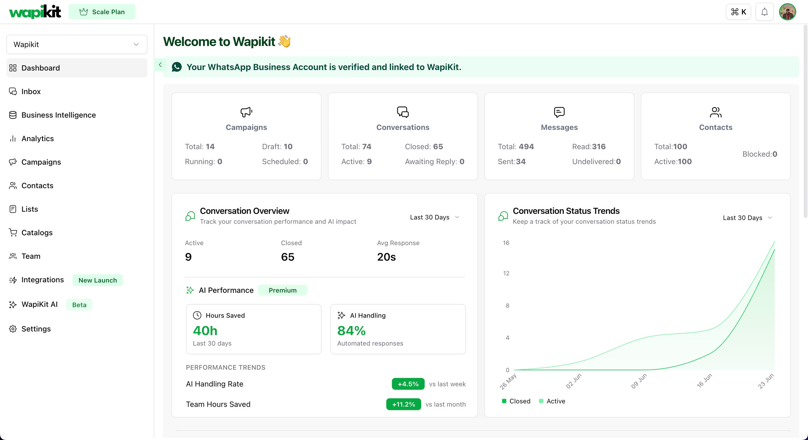

# Wapikit

Wapikit is an ecosytem to make whatsapp marketing and customer engagement accessible for businesses.

# Products

## [Wapikit](https://app.wapikit.com) - Core Product

Wapikit is an AI Automated comprehensive platform designed to simplify WhatsApp communications for businesses.

It acts as a central hub where companies can manage all their WhatsApp messaging, from receiving messages to sending various types of messages to individual contact and to broadcast them on scale to millions.

Key features include:

- Inbuilt AI Agent: Your own marketing person who takes the overhead of most human intensive repetitive tasks.

- Shared Team Inbox: A live, centralized inbox that lets your team view and respond to customer messages in real time.

- Multi-Message Support: Support for different message types such as text, images, videos, documents, stickers, interactive messages (with buttons), templates, reactions.

- Seamless WhatsApp Integration: Built over the WhatsApp Business APIs, Wapikit handles incoming webhooks and outbound messaging reliably.

Wapikit is your go-to solution for integrating and managing WhatsApp messaging in a streamlined, scalable, and efficient way.

Watch the Demo Video [here](https://www.youtube.com/watch?v=hiRfO6c8GdI)
 
## [Wapi.js](https://github.com/wapikit/wapi.js) - Javascript SDK over whatsapp APIs

[NPM](https://www.npmjs.com/package/@wapijs/wapi.js) | [Documentation](https://js.wapikit.com)

## [Wapi.go](https://github.com/wapikit/wapi.go) - Golang SDK over whatsapp APIs

[Go Pakcage](https://pkg.go.dev/github.com/wapikit/wapi.go) | [Documentation](https://go.wapikit.com)

 
Check about us [here](https://wapikit.com/) | Find us on [LinkedIn](https://www.linkedin.com/company/wapikit/)

## Contact

For any queries, please reach out at our whatsApp [@wapikit](https://wa.me/918368670749?text=Reaching%20out%20from%20Wapikit%20Github%20Organization)

